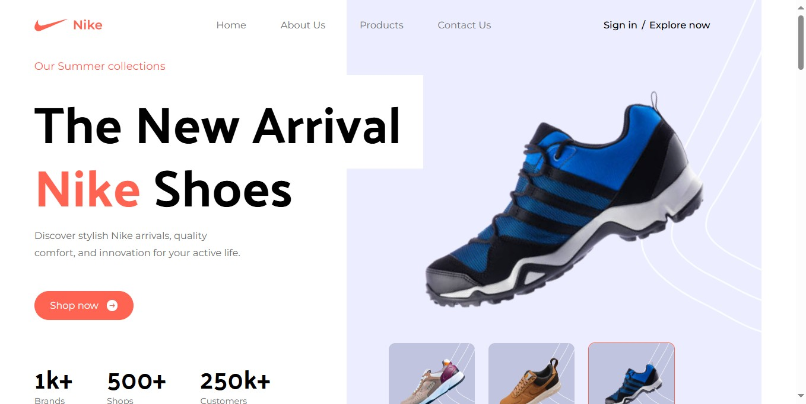

# Nike Landing Page Website

A beautifully designed Nike website created with React and Tailwind CSS. This project demonstrates my ability to customize Tailwind CSS for a responsive layout and showcases my skills with the latest technologies in the stack.



## Table of Contents

- [Introduction](#introduction)
- [Installation](#installation)
- [Usage](#usage)
- [Future Enhancements](#future-enhancements)
- [Contributing](#contributing)
- [License](#license)

## Introduction

This project is a basic website layout to showcase my Tailwind CSS knowledge and its customization capabilities. The website features a responsive design, customized Tailwind config, and proper font integration.

## Installation

1. Clone the repository:
   ```bash
   git clone https://github.com/Promisead/nike_website.git
   ```
2. Navigate to the project directory:
   ```bash
   cd nike-website
   ```
3. Install dependencies:
   ```bash
   yarn install
   ```
4. Start the development server:
   ```bash
   yarn dev
   ```

## Usage

Open your browser and go to `http://localhost:5173` to view the website.

## Future Enhancements

This is a basic project to demonstrate my Tailwind CSS knowledge. In the future, I plan to add the following features to make it more robust:

1. **Animation:** Add smooth animations to enhance user experience.
2. **Product Detail Page:** Provide detailed information about each product.
3. **Add to Cart Functionality:** Allow users to add products to their cart.
4. **Payment Gateway:** Integrate a payment gateway for online transactions.
5. **Hamburger Links on Mobile View:** Improve navigation on mobile devices.
6. **Complete CMS:** Develop a backend with Express.js or convert the project to a Next.js app for a full-fledged CMS.

## Contributing

Contributions are welcome! Please fork the repository and submit a pull request for any improvements or features.

## License

This project is licensed under the MIT License. See the [LICENSE](LICENSE) file for details.
# nike_website
